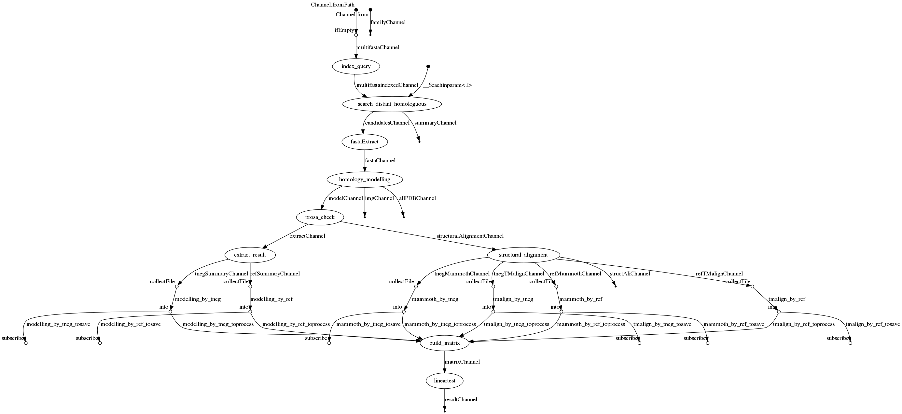
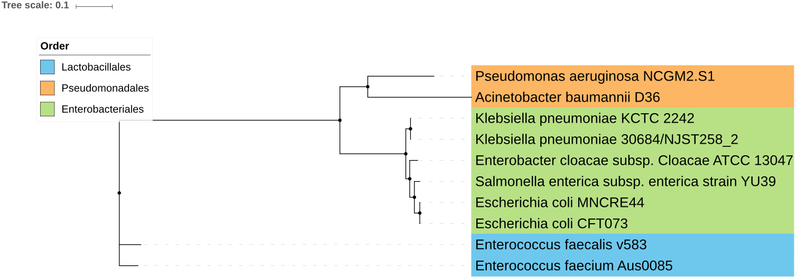

# PCM : Pairwise Comparative Modelling
[Amine Ghozlane](https://research.pasteur.fr/fr/member/amine-ghozlane/) (amine.ghozlane@pasteur.fr) (@xealf8)

## Contents

- [Introduction](#introduction)
- [Usage](#usage)
- [Installation](#installation)
- [Running PCM](#running-pcm)
- [Results](#results)
- [Dependencies](#dependencies)
- [Citation](#citation)
- [Contact](#contact)


## Introduction

PCM is a generic method using homology modelling to increase the specificity of functional prediction of proteins, especially
when they are distantly related from proteins for which a function is known. The principle of PCM is to
build structural models and assess their relevance using a specific training approach. PCM uses the
list of sequences of reference proteins from a given family, the structures related to this family (they
will be used as structural templates in the PDB format) and a series of negative references.
The pcm process follow this dag:



## Usage

PCM is available on [galaxy](https://galaxy.pasteur.fr/) in section Microbiome_analysis/PCM.
A tutorial is available [here](example/PCM_in_galaxy.pdf). This version is restrained to investigate a catalogue of 100,000 proteins.

## Installation

PCM is deployed using [singularity](https://singularity.lbl.gov/) and nextflow.
To install singularity on a Linux platform, follow these commands:
```
VERSION=2.5.2
wget https://github.com/singularityware/singularity/releases/download/$VERSION/singularity-$VERSION.tar.gz
tar xvf singularity-$VERSION.tar.gz
cd singularity-$VERSION
./configure --prefix=/usr/local
make
sudo make install
```
It is recommanded to install singularity as root. NEWUSER namespace runtime error can occur on Red Hat system when singularity is installed by an user (see  https://github.com/sylabs/singularity/issues/415).
Download PCM singularity image (warning: the file is heavy ~ 1Go):
```
wget https://zenodo.org/record/7432803/files/pcm_202010.img
```
Install nextflow:
```
curl -s https://get.nextflow.io | bash
```

## Running PCM

### Start

For this example we will search resistance genes in the proteome of the following species:

This set was obtained from NCBI. The computation can be performed with the following command:
```
git clone https://github.com/aghozlane/pcm.git
cd pcm
# See help with
nextflow pcm.nf --help
# Run example calculation
nextflow pcm.nf  --in example/example_proteome.faa --out result -w work/ -with-singularity pcm_202002.img
```
You can analyze multiple files as follow:
```
# Do not run
nextflow pcm.nf  --in '*.faa' --out result -w work/ -with-singularity pcm_202002.img
```

### Command line options


```
N E X T F L O W  ~  version 19.01.0
Launching `pcm.nf` [happy_blackwell] - revision: b2185a98ff
pcm.nf --in <fasta_file> --out <output_dir> --cpus <nb_cpus> -w <temp_work_dir>
--in Multifasta file containing protein sequence (default /pasteur/homes/aghozlan/pcm/example/example_proteome.faa).
--out Output directory (default /pasteur/homes/aghozlan/pcm/example/res).
--cpu Number of cpus for homology modeling processing (default 6)
--cpu_candidates Number of cpus for candidates search (default 12)
--family Select the family to consider (default aac2,aac3_1,aac3_2,aac6,ant,aph,arnm,blaa,blab1,blab3,blac,blad,dfra,erm,fos,ldt,mcr,qnr,sul,tetM,tetX,van)
--hfinder_evalue E-value threshold to search candidates (default 0.00001)
--modelling_quality Level of quality of the homology modelling fast, normal or high (default fast)
--model Number of model calculated (default 6)
--template Number of template for modelling (default 3)
--bootstrap Number of bootstrap calculated during statistical analysis (default 10)
```

#### Option --in

PCM takes as input a fasta file containing protein sequence. They must follow this next format:
```
>ID1
MNTFGQIHNNMPYLFLLAFIMNFYDQFNNSISGQEMCYEVESI
FNNHQVDIIGAPAAAFKPLELQKGLGTKGAIVNYPILQVTGNI
>ID2
MNTFGQIHNNMPYLFLLAFIMNFYDQFNNSISGQEMCYEVESI
FNNHQVDIIGAPAAAFKPLELQKGLGTKGAIVNYPILQVTGNI
```
The ID is >name (without any space or point in the name).

#### Option --family

One or several ARD families can be investigated. User must indicate the selected family as follow: --family family1,family2. By default, PCM allows to screen the ARD families of clinical interest. All current possibilities are indicated here: aac2,aac3_1,aac3_2,aac6,ant,aph,arnm,blaa,blab1,blab3,blac,blad,dfra,erm,fos,ldt,mcr,qnr,sul,tetM,tetX,van

#### Option --hfinder_evalue

Set the E-value threshold for candidate selection. This threshold impacts the candidates selection. A high e-value will select more candidates for PCM.


#### Option --modelling_quality

Select the quality level of the modelisation. A high level of modelling quality will make PCM to spend more time to improve the protein model. By default, the mode fast is enough to predict an ARD.

#### Option --model

Select the number of model to calculate for modelling step. The homology modelling is a heuristic approach where the starting point is crucial. A high number of model corresponds to a high number of different start. By default, the number of model is set to 6 which is enough to screen the set of possibilities.

#### Option --template

Select the number of template to consider for modelling step. Setting this parameter higher makes the PCM more precise with a risk of overfitting. However some ARDs families do not have more than 3 ARD templates (notably MCR).

#### Option --bootstrap

Select the number of bootstrap to calculate for candidate classification. Setting this higher makes the classification more precise with an increase of calculation time.

### Singularity

The usage of singularity with Nextflow requires that the input data/result/work to be accessible in the virtual image. If you do not set your calculation in your home folder, you might need to explain to nextflow where it can mount this space, like here:
```
#nextflow config file
singularity {
            enabled = true
            autoMounts = false
            runOptions = '--bind  /mnt:/home'
}
# the directory /mnt that contains my data is mounted in the singularity
# on its home directory

# Do not run
# You can then provide this configuration like this:
nextflow pcm.nf  --in example/example_proteome.faa --out result -w work/ -with-singularity pcm_202002.img -c nextflow.config
```
More information about nextflow and singularity are available [here](https://www.nextflow.io/docs/latest/singularity.html).

### Cluster configuration

Nextflow uses a configuration file to deploy computation on cluster, an example of this file is available [here](nextflow_global.config).
This file enables the usage of singularity on a slurm scheduler and need to be adjusted for each cluster configuration. Profiles are activated with the command (-profile singularity  -c nextflow_global.config).
```
# The profile singularity correspond to an execution on a cluster environment
profiles{
    singularity {
        process.container = 'file:///pasteur/homes/aghozlan/pcm/img/pcm_202002.img'
        singularity.enabled = true
        singularity.autoMounts = false
        singularity.runOptions = "-B /pasteur:/pasteur"
        process.executor = 'slurm'
        process.clusterOptions='--qos=fast'
        process.queue = 'fast'
    }
}
# Do not run
# You can then provide this configuration like this:
nextflow pcm.nf  --in example/example_proteome.faa --out result -w work/ -with-singularity pcm_202002.img -c nextflow_global.config -profile singularity
```
In the profile singularity, I indicate where is the container (with process.container). I mount data directory with singularity.runOptions (the path are here indicatives). I select the type of scheduler (with executor) and our cluster option: the qos and the partition for hubbioit.


## Results

### PCM result

The PCM result file contains all the score collected on the protein structures and their difference (delta annotated with d_). 
Their is two type score in PCM:
    - Statistical potentials that describe the quality of a given model
    - Score of the structual alignment between the model and the reference or the negative reference

#### Model quality


The model quality is estimated by Modeller, Prosa and ProQ. Here is short description of the score provided by these softwares.

Score | Software | Description
---|---|---
molpdf | Modeller | Objective function optimized by Modeller
dope_score | Modeller |  The DOPE score of a random protein conformation is estimated by a weighted sum of protein composition over the 20 standard amino acid residue types, where each weight corresponds to the expected change in the score by inserting a specific type of amino acid residue. The weights are estimated from a separate training set of 1,686,320 models generated by MODPIPE.
normalized_dope | Modeller | The normalized DOPE score is derived from the statistics of raw DOPE scores.
GA341_score | Modeller | The GA341 score [Melo et al., 2002,John & Šali, 2003] uses the percentage sequence identity between the template and the model as a parameter.
zscore | Prosa | Estimates the compatibility of a sequence with a given fold based on the knowledge base of 3D-structure available [[Sippl 1993](https://onlinelibrary.wiley.com/doi/abs/10.1002/prot.340170404)].
maxsub | ProQ | Prediction of the MaxSub score performed by a neural network based on atom  and  residue  contacts,  solvent  accessibility,  similarity between the model secondary structure and the secondary structure predicted by Psispred.MaxSub, on the otherhand, divides the structural comparison score by the length of the correct target structure. 
lgscore | ProQ | Prediction of the Levitt-Gerstein (LG) score score performed by a neural network based on atom  and  residue  contacts,  solvent  accessibility,  similarity between the model secondary structure and the secondary structure predicted by Psispred.  LGscore uses  a  statistical  distribution  to  relate Sstr to the  probability  of finding a higher score by chance (P-value).
mypmfs | mypmfs | Energy potential learned from the ARDs set of PCM [[Postic 2018](https://www.ncbi.nlm.nih.gov/pubmed/29857183)].


#### Quality of the structural alignment

Structural alignment softwares try to find  the  maximum  subset  of  similar  local  structures  thathave  their  corresponding  C-alpha close  in  cartesian  space. 
We align the model with the reference ARD that are used as templates by Modeller.

Score | Software | Description
---|---|---
Z-score_mammoth | Mammoth | The probability of obtaining the given proportion of aligned residues (with respect to the shortest protein model) by chance based  on  extreme-value fitting of the scores.
TM-score_mammoth | Mammoth | The Template Modeling score is variation of LG-Score, it reflects the distance between optimal aligned residues. See [[Zhang, Skolnick 2004](https://onlinelibrary.wiley.com/doi/full/10.1002/prot.20264)].
RMSD_TMalign | TM-align | Root Mean Square Distance between corresponding residues. 
TM-score_TMalign | TM-align | The Template Modeling score is variation of LG-Score, it reflects the distance between optimal aligned residues. See [[Zhang, Skolnick 2004](https://onlinelibrary.wiley.com/doi/full/10.1002/prot.20264)].


### Prediction output

The classification performed by PCM lies on the result of the SVM classification based on the different score mentionned ealier and on the TM-score which provides a clear estimatimation of the similarity of the model with a reference [[Zhang 2010](https://academic.oup.com/bioinformatics/article/26/7/889/213219)]). The problem solved by PCM is essentially linear. We use a logistic regression to classify the best models from Modeller.   

### All Outputs

PCM results are available as following:

File | Directory | Description
---|---|---
**pcm_result.tsv** | main directory | This table gives all the score obtained during modelisation with reference and negative reference modelling. This file is provided to our classifier to determine if the candidate is more a reference or a negative reference.
**prediction_output.tsv** | main directory | This table is the result of the classification of each candidates. It provides the pvalue associated to the score to be a potential reference and the estimated quality of the prediction.
**result.html** | main directory | This html shows the roc curve and weight associated to each score during the learning phase of machine learning. It uses an "universal model" (/usr/local/bin/database/universal_model.csv) that contains the score that we obtained for know ARD and know "not ARD". It presents the result obtained by a svm and the result for the candidate sequence.
**_candidates.fasta** | candidates | This fasta file  gives the selected hit from blast/ssearch/hmmer and length criterion for one ARD family
**_candidates_hit_length.tsv** | candidates | It indicates which hit meet the length criterion
**_candidates_hit_properties** | candidates | It regroups all the information of blast/ssearch/hmmer and clustalo alignments for each candidates (Identity,Similarity, coverage)
**candidates_by_ref.tsv** | modelling | This table gives the results obtained for candidates modelled with a reference template in the following order: molpdf,	dope_score, normalized_dope,	GA341_score,	zscore,	maxsub_ref,	lgscore
**candidates_by_tneg.tsv** | modelling | This table gives the results obtained for candidates modelled with a negative reference template (same as ref models)
**mammoth_by_ref.tsv** | modelling | This table gives of the structural alignment results with the reference templates using Mammoth (candidate ard_type, PDB_reference,	zscore_mammoth,	TM-score_mammoth)
**mammoth_by_tneg.tsv** | modelling | This table gives the structural alignment results with the negative reference templates using Mammoth (same as mammoth by ref)
**TMalign_by_ref.tsv** | modelling | This table gives of the structural alignment results with the reference templates using TMalign (candidate ard_type,	PDB_reference,	RMSD_TMalign,	TM-score_TMalign)
**TMalign_by_tneg.tsv** | modelling | This table gives the structural alignment results with the negative reference templates using TMalign (same as TMalign by ref)
**best_model_ref** | modelling/*_candidates/ | This directory provide the best model obtained for one given candidate using a reference template
**best_model_tneg** | modelling/*_candidates/ | This directory provide the best model obtained for one given candidate using a negative reference template

The other files correspond to intermediate results.

## Dependencies

*  __Blastp__
  Search of distant homologous for the candidate sequence.
   _Altschul, S.F., Gish, W., Miller, W., Myers, E.W. & Lipman, D.J. "Basic local alignment search tool." J. Mol. Biol., 1990, 215:403-410._
* __Clustal 0mega__
Perform multiple alignment between candidate and reference protein sequence.
	Sievers, F., & Higgins, D. G. (2014). Clustal Omega, accurate alignment of very large numbers of sequences. In _Multiple sequence alignment methods_ (pp. 105-116). Humana Press, Totowa, NJ.
* __HMMER__
 Search of distant homologous for the candidate sequence.
Johnson, L. S., Eddy, S. R., & Portugaly, E. (2010). Hidden Markov model speed heuristic and iterative HMM search procedure. _BMC bioinformatics_, _11_(1), 431.
* __Modeller__
 Performs homology modelling of candidate sequence and reference protein structures.
 Fiser, A., & Do, R. K. G. (2000). Modeling of loops in protein structures. _Protein science_, _9_(9), 1753-1773.
* __MyPMFs__
 Assess the model quality compared to other PDB with a resistance activity.
 Postic G., Hamelryck T., Chomilier J., Stratmann D. (2018). MyPMFs: a simple tool for creating statistical potentials to assess protein structural models. _Biochimie_, 151, 37-41.
* __ProQ__
Performs quality checking protein models.
Wallner, B., & Elofsson, A. (2003). Can correct protein models be identified?. _Protein science_, _12_(5), 1073-1086.
* __Prosa__
Performs quality checking protein models.
Wiederstein, M., & Sippl, M. J. (2007). ProSA-web: interactive web service for the recognition of errors in three-dimensional structures of proteins. _Nucleic acids research_, _35_(suppl_2), W407-W410.
* __Psipred__
Predicts the secondary structure of candidate sequence. This secondary secondary structure is used by modeller as a topology constraint.
Jones, D. T. (1999). Protein secondary structure prediction based on position-specific scoring matrices1. _Journal of molecular biology_, _292_(2), 195-202.
* __ssearch__
Search of distant homologous for the candidate sequence.
Pearson, W. R., & Lipman, D. J. (1988). Improved tools for biological sequence comparison. _Proceedings of the National Academy of Sciences_, _85_(8), 2444-2448.
* __R packages__
    * __mlr with e1071__
Resolves the classification problem to use a Support Vector Machine (with a linear kernel).
Bernd Bischl, Michel Lang, Lars Kotthoff, Julia Schiffner, Jakob Richter, Erich Studerus, Giuseppe Casalicchio, Zachary M. Jones; 17(170):1−5, 2016.
    * __pROC__
Draw a classification ROC curves
Robin, X., Turck, N., Hainard, A., Tiberti, N., Lisacek, F., Sanchez, J. C., & Müller, M. (2011). pROC: an open-source package for R and S+ to analyze and compare ROC curves. _BMC bioinformatics_, _12_(1), 77.
pander
    * __corrplot__
Draw a correlation plot.
    * __ggplot2__
Draw plots.
    * __vgv/ggbiplot__
Draw a biplot. Package website is [here](https://github.com/vqv/ggbiplot).
    * __DT, pander, knitr and rmarkdown__
Make a nice report.
	
	
## Citation

Please cite the following publication if you use PCM:
Ruppé E.¹, Ghozlane A.¹, Tap J.¹ et al. (2018) Prediction of the intestinal resistome by a novel 3D-based method. Nature Microbiology (Article available [here](https://www.nature.com/articles/s41564-018-0292-6)).

## Acknowledgment

We thank Vincent Guillemot for the help with SVM classification.

## Contact

If you have any comments, questions or suggestions, or need help to use PCM, please contact the author [here](mailto:amine.ghozlane@pasteur.fr).
